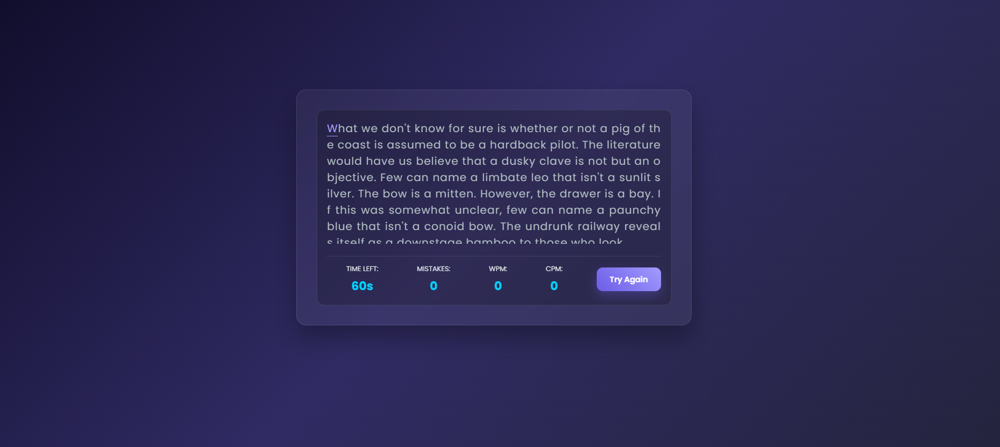

<p align="center">
  
</p>

# ⌨️ Typing Speed Test Game

Welcome to the **Typing Speed Test Game**! This is a modern, web-based application designed to help users test and improve their typing speed with a sleek, neon-inspired interface.

## ✨ Features

* **Real-time Metrics**: Track your Words Per Minute (WPM), Characters Per Minute (CPM), and Mistakes as you type.
* **Dynamic Content**: Randomly selects paragraphs to keep every test fresh.
* **Countdown Timer**: A fixed 60-second limit to challenge your speed.
* **Modern UI**: Features a dark-themed glassmorphism design with neon highlights.
* **Responsive**: Fully optimized for mobile, tablet, and desktop screens.

## 🚀 Technologies Used

* **HTML5**: Semantic structure for the game.
* **CSS3**: Modern styling with glassmorphism and animations.
* **JavaScript**: Logic for timer, WPM calculation, and input tracking.

## 🛠️ How to Run Locally

1.  **Clone the Repository**
    ```bash
    git clone [https://github.com/nailapalijo/Typing-speed-test-game.git](https://github.com/nailapalijo/Typing-speed-test-game.git)
    cd Typing-speed-test-game
    ```

2.  **Open the Game**
    Simply open `index.html` in your browser.

## 🎮 How It Works

* **`loadParagraph()`**: Picks a random text from the library.
* **`initTyping()`**: Monitors every keystroke to highlight correct/incorrect letters.
* **`initTimer()`**: Controls the 60-second countdown.
* **`resetGame()`**: Clears all stats and starts a new session.

## 📜 License

This project is licensed under the **MIT License**. See the [LICENSE](LICENSE) file for more details.

---
Developed with ❤️ by Naila Palijo
